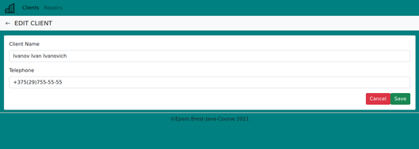
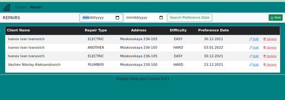
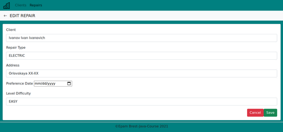
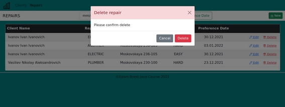

Functional specification  of application "Municipal Service" v 1.0

# Municipal Service

## Introduction

**Purpose**:  develop Web application to keeping records of tenants' requests for repairs.

### Functions application:

- View, add and edit clients .
- Add, edit ,View repairs ordered by client.
- Filtering repairs depend on preference date.

### Navigation to specification:

### [1. Interaction with the page Clients ](#link1)

### <a href="#link2"> 2. Interaction with the page Repairs</a>
<a name="link1">

## 1. Interaction with the page Clients </a>
</a>

### 1.1  Viewing the list of clients 

The mode is intended for viewing the list of clients.

**The main scenario:**
-  Need to select  "Clients" menu item
- The form for viewing the list of clients is displayed

The following fields are displayed:
- **Name**-client's name
- **Number of repairs**-Number of repairs ordered by client
### 1.2 Adding the client
**The main scenario:**
* The user, being in the clients viewing mode, clicks the  "**New**"button
* The form for adding a new client is displayed
* Need to in enter data and click the "**save**"button
* If the data has been successfully added, the form for viewing the list of clients opens

In the form for Add the client following buttons are displayed:
* **save** - for add client
* **cancel** - for return to the form for viewing the list of clients
* <- - for return to the form for viewing the list of clients
* **Repairs** - enter to the form for viewing the list of repairs
* **Clients** - enter to the form for viewing the list of clients

  

### 1.3 Editing  client

**The main scenario:**

- The user, being in the clients viewing mode, presses the "**edit**" button in the line of the required client
- The form for editing the client is displayed.

- Adding date :
  **Name**- string format no more than 50 characters and  must be unique in the database
  **Telephone**- optional field string format 
- Confirm editing to click the button "**Save**",or click the button "**Cancel**" if you want to the changes are not saved and the form for viewing the list of clients is displayed

### 1.4 Deleting client

**The main scenario:**

- The user, being in the clients viewing mode, presses the button "**delete**"
- A confirmation dialog mode for deletion is displayed."Please confirm delete!"
- Click the button "**Delete**" if you really want to delete the client
- The client entry is removed from the database if there are no repairs associated with the client. If an error occurs during the operation, an error message is displayed
- Click the button "**Cancel**"the changes are not saved and the form for viewing the list of clients is displayed

## <a name="link2">2. Interaction with the page Clients Repairs</a>
## 2.1 Viewing the list of repairs
The mode is intended for viewing the list of repairs.

**The main scenario**:
* Need to select  "**repairs**" menu item.
* - The form for viewing the list of repairs is displayed
The following fields are displayed:
* **New** -for add repair
* **Search Preference Date** - Filtering repairs depend on preference date
#### In the table fields are displayed:
* **Client Name**- the name of client who ordered the repair
* **"Repair Type"**-type of repair(ELECTRIC,PLUMBER,FINISHING,ANOTHER)
* **"Address"**-address of repair
* **"Difficulty**-level of difficulty ordered repair
* **Preference Date"**-preference date
* **delete** - for delete repair
* **edit** - for edit repair

  

## 2.2 Adding repair
**The main scenario**:
* The user, being in the repairs viewing mode, clicks the  "**New**"button
* The form for adding a new repair is displayed
* Need to in enter data and click the "**save**"button
* If the data has been successfully added, the form for viewing the list of clients opens

In the form for Add the repair following buttons are displayed:
* **save** - for add repair
* **cancel** - for return to the form for viewing the list of repairs
* <- - for return to the form for viewing the list of repairs
* **Repairs** - enter to the form for viewing the list of repairs
* **Clients** - enter to the form for viewing the list of clients

  
 

## 2.3 Editing repairs

**The main scenario**:
- The user, being in the repairs viewing mode, presses the "**edit**" button in the line of the required repair
- The form for editing the repair is displayed.
- Confirm editing to click the button "**Save**",or click the button "**Cancel**" if you want to the changes are not saved and the form for viewing the list of repairs is displayed

In the form for Editing the repair following buttons are displayed:
* **save** - for add repair
* **cancel** - for return to the form for viewing the list of repairs
* <- - for return to the form for viewing the list of repairs
* **Repairs** - enter to the form for viewing the list of repairs
* **Clients** - enter to the form for viewing the list of clients
 
  
## 2.4 Deleting repair
**The main scenario**
- The user, being in the repairs viewing mode, presses the button "**delete**"
- A confirmation dialog mode for deletion is displayed."Please confirm delete!"
- Click the button "**Delete**" if you really want to delete the repair
- The repair entry is removed from the database .If an error occurs during the operation, an error message is displayed
- Click the button "**Cancel**"the changes are not saved and the form for viewing the list of repairs is displayed
* 
  

  ## 2.5 Filtering the list of repairs
**The main scenario**:
* The user, being in the repairs viewing mode, select the start date of the period and  the end date of the period"
* Click the button "**Search Preference Date**" the filtered list of repairs is displayed
  

 

