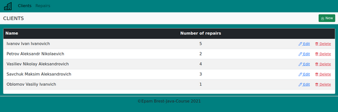
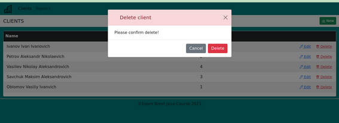
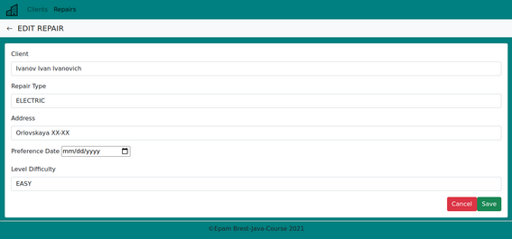
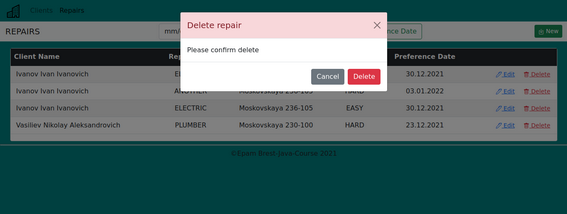

Функциональная спецификация програмы "Municipal Service" v 1.0

# Municipal Service

## Видение

**Цель**: разработать Web приложение для ведения учёта заявок квартиросъёмщиков на ремонтные работы.

### Функции приложения:

- Добавление,редактирование,просмотр клиентов.
- Добавление,редактирование,просмотр работ заказанных клиентом.
- Фильтр работ по желаемой дате выполнения.

### Навигация по спецификации:

#### [1. Взаимодействие со страницей Clients ](#link1)

#### <a href="#link2"> 2. Взаимодействие со страницей Repairs</a>
<a name="link1">

## 1. Взаимодействие со страницей Clients </a>
</a>

### 1.1 Просмотр списка клиентов 

Данный режим программы предназначен для просмотра списка клиентов.

**Основной сценарий:**
-  Требуется выбрать пункт меню "Clients"
- Отображается форма просмотра списка всех клиентов

 В списке отображаются следующие колонки:
- **Name**-имя клиента
- **Number of repairs**-количество работ заказанных клиентом
### 1.2 Добавление клиента
**Основной сценарий:**
* Находясь в форме просмотра списка клиентов нужно нажать кнопку "**New**"
* Отображается форма добавления плейлиста
* Нужно ввести данные и нажать кнопку "**save**"
* Если данные сохранены успешно, то открывается форма просмотра списка клиентов

В форме добавления клиента доступны кнопки:
* **save** - для добавления плейлиста
* **cancel** - для возврата к форме списка плейлистов
* <- - для возврата к форме список  клиентов
* **Repairs** - переход в режим просмотра списка ремонтов
* **Clients** - переход в режим просмотра списка клиентов

  

### 1.3 Редактирование информации о клиенте

**Основной сценарий:**

- Для редактирования клиента находясь в режиме просмотра списка клиентов нужно нажать кнопку "**edit**"
- Отображается форма редактирования
- Редактирование данных :
  **Name**-строка не более 50 символов
  **Telephone**-формат телефонного номера
- Подтвердите изменения нажав кнопку "**Save**",либо нажав "**Cancel**" для отмены подтверждения

### 1.4 Удаление информации о клиенте

**Основной сценарий:**

- Для удаления нужно  находясь в режиме просмотра списка клиентов нажать кнопку "**delete**"
- Отображается форма подтверждения удаления
- Подтвердите удаление нажав кнопку "**Delete**",либо нажав "**Cancel**" для отмены подтверждения и возврата в режим просмотра списка клиентов 

## <a name="link2">2. Взаимодействие со страницей Repairs</a>
## 2.1 Просмотр списка работ
Данный режим программы предназначен для просмотра  списка работ.

**Основной сценарий**:
* Нужно выбрать пункт меню "**repairs**".
* Открывается форма просмотра списка работ
В форме просмотра списка работ доступны кнопки:
* **add** - для добавления работы
* **Search Preference Date** - для фильтрации списка работ по желаемой дате выполнения
#### В таблице:
* **Client Name**- имя клиента заказавшего данную работу
* **"Repair Type"**-тип работы(ELECTRIC,PLUMBER,FINISHING,ANOTHER)
* **"Address"**-адрес выполнения работы
* **"Difficulty**-уровень сложности работы
* **Preference Date"**-предпочтительная дата выполнения
* **delete** - для удаления работы
* **edit** - для редактирования работы

  

## 2.2 Добавление работы
**Основной сценарий**:
* Находясь в форме просмотра списка работ нужно нажать кнопку "**New**"
* Отображается форма добавления работы
* Нужно ввести  данные и нажать кнопку "**save**"
* Если данные сохранены успешно, то открывается форма просмотра списка работ

В форме добавления работ доступны кнопки:
* **Save** - для подтверждения добавления работы
* **Cancel** - для возврата к форме списка работ
* <- - для возврата к форме списка работ
* **<--EDIT REPAIR** - для возврата  в режим просмотра списка работ
* **Clients** - переход в режим просмотра списка клиентов

  
 

## 2.3 Редактирование работы 

**Основной сценарий**:
* Находясь в форме просмотра списка работ нужно нажать кнопку "**edit**"
* Отображается форма редактирования работы
* Нужно ввести данные и нажать кнопку "**save**"
* Если данные сохранены успешно, то открывается форма просмотра списка работ

В форме редактирования работы доступны кнопки:
* **Save** - для сохранения редактирования работы
* **Cancel** - для возврата к форме списка работ
* **<- -** для возврата к форме списка работ
* **Repairs** - переход в режим просмотра списка работ
* **Clients** - переход в режим просмотра клиентов
 
  
## 2.4 Удаление работы
**Основной сценарий**
* Находясь в форме просмотра списка работ нужно нажать кнопку "**delete**".
* Отображается форма удаления работы
* Если нажать кнопку "**delete**", то происходит удаление работы
*  **cancel** - для отмены удаления и возврату к форме списка работ
* 
  

  ## 2.5 Фильтрация списка работ
**Основной сценарий**:
* Находясь в форме просмотра списка работ нужно ввести желаемые даты для поиска в поля ввода дат в порядке "дата начала поиска - дата конца поиска"
* Если нажать кнопку "**Search Preference Date**" происходит переход к отфильтрованному списку работ
  

 

